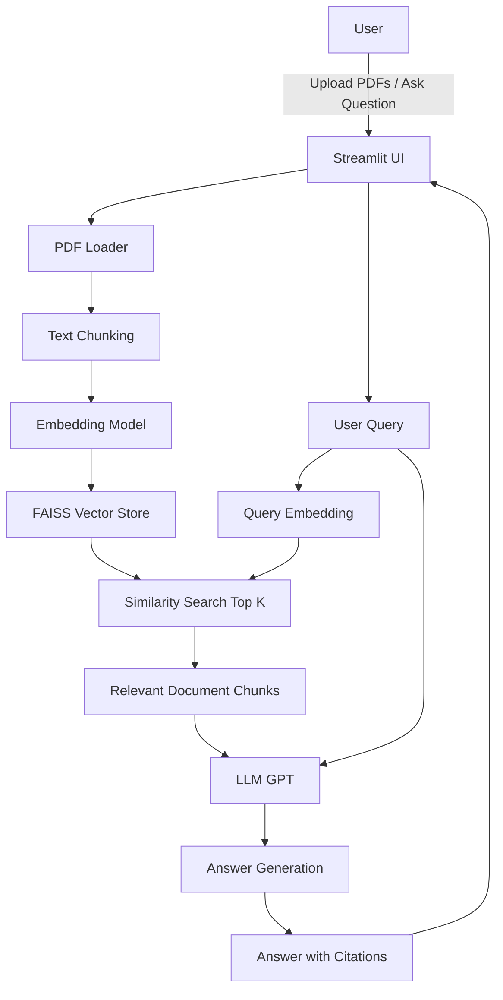

# ResearchMind: RAG-Based AI Research Paper Assistant

> An AI-powered research assistant that reads, understands, and answers questions from research papers with **accurate citations** using Retrieval-Augmented Generation (RAG).

---

## Overview

**ResearchMind** is a production-ready AI system designed to simplify academic research. It enables users to upload research papers and interact with them conversationally.

Unlike traditional LLMs, this system uses **Retrieval-Augmented Generation (RAG)** — a technique that retrieves relevant document context before generating answers, improving factual accuracy and reducing hallucinations.

---

## Key Features

- **Multi-PDF Support** — Upload and analyze multiple research papers
- **Semantic Search** — Retrieve the most relevant sections using embeddings
- **Conversational Q&A** — Ask natural language questions about papers
- **Citation-Based Answers** — Get answers with exact source references (page-level)
- **Fast Retrieval** — FAISS-powered vector search
- **LLM Integration** — Context-aware responses using modern LLMs
- **Interactive UI** — Built with Streamlit for ease of use
- **Reusable Indexing** — Avoid reprocessing documents

---

## System Architecture



---

## Tech Stack

- Python
- LangChain
- OpenAI GPT-4o-mini
- FAISS Vector Database
- Streamlit
- Retrieval-Augmented Generation (RAG)

## Installation

Clone the repository

```bash
git clone https://github.com/Vaishuu-creator/RAG-Based-AI-Research-Paper-Assistant.git
cd RAG-Based-AI-Research-Paper-Assistant
```

Install dependencies

```bash
pip install -r requirements.txt
```

Create .env file
```ini
OPENAI_API_KEY=your_api_key_here
```

Run the application
```bash
streamlit run app.py
```

